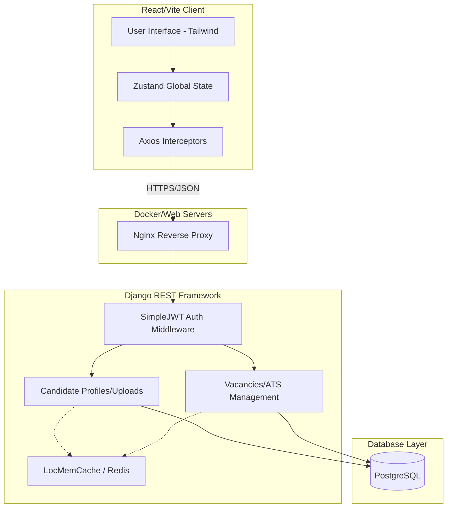

# Youth Internship E-Recruitment Portal System

[](https://vitejs.dev/)
[](https://reactjs.org/)
[](https://www.django-rest-framework.org/)
[](https://www.postgresql.org/)
[](https://www.docker.com/)

A modern, production-ready E-Recruitment Portal built to facilitate the secure application, multi-step review, and administrative management of candidate internships. Designed with high-performance metrics, containerized infrastructure, and an entirely decoupled frontend/backend architecture.

## 🏗 System Architecture

The ecosystem relies on an asynchronous event-driven model mapped through RESTful APIs, protected securely by JWT tokens.



## ✨ Core Application Features

### 👤 For Candidates (Applicants)
- **Document Cross-Validation:** Mandatory secure PDF uploading for resumes, identification, and cover letters before applying.
- **Dynamic Vacancy Application:** Real-time visibility of Open, Pending, and Closed internship postings.
- **Application Tracking System (ATS):** Candidates automatically track the state of their submissions (`PENDING` -> `REVIEWED` -> `ACCEPTED` / `REJECTED`).

### 🛠 For Administrators (HR / Ministry)
- **Role-Based Access Control:** Strict routing preventing unauthorized access to analytics or job management suites.
- **Data-Driven Intelligence:** Interactive data visualizations rendering applicant demographics, submission timelines, and systemic conversion rates using `Recharts`.
- **Integrated Applicant Reviews:** Fully featured CRM-style listing to manage, approve, or reject user applications based on securely fetched mandatory documents.

## 💻 Tech Stack Overview

| Domain | Technology | Implementation Detail |
| :--- | :--- | :--- |
| **Frontend Framework** | React 19 & Vite | Strict-mode compliant, hyper-fast local HMR. |
| **State Management** | Zustand | Prevents prop-drilling; globally synchronizes JWT Tokens and Auth persistence. |
| **Styling Strategy** | Tailwind CSS v4 | Fully customized design system with responsive dynamic grids. |
| **Backend Framework** | Django + DRF | Robust API design using serializers, ModelViewSets, and granular permissions. |
| **Database** | PostgreSQL | Relationally maps Applicant documents dynamically against Vacancy instances. |
| **DevOps** | Docker Compose | Nginx routing over static containers to replicate production exactly. |

## 🚀 Deployment Strategy (Production)

The repository has been surgically structured to execute end-to-end split deployments utilizing SaaS free tiers seamlessly. Overlays govern cross-origin data.

1. **Vercel (Frontend)**: Reads from `vercel.json` and `.env.production` to bypass typical SPA Refresh 404s and statically weave the backend rendering URL into the production build pipeline.
2. **Render (Backend)**: Binds to `render.yaml` declaring root capabilities. Utilizing `LocMemCache` as a Redis fallback circumvents strict premium constraints. `Dockerfile` commands invoke database migrations and manifest caching dynamically upon every container boot, averting 500 errors.

### Local Initialization (Testing)

To spin up the entire system directly on your local machine matching production parity:

```bash
# 1. Provide temporary configuration
cp .env.example .env

# 2. Build and boot the environment entirely isolated
docker compose up --build -d

# 3. Apply backend initialization dynamically
docker compose exec backend python manage.py makemigrations
docker compose exec backend python manage.py migrate
docker compose exec backend python manage.py seed_admin
```
The interface spans securely across `http://localhost:3000` executing queries against port `8000` via Nginx intercepts.

---

> **Built adhering to 12-Factor App paradigms for absolute scalability, security, and state-isolation.**
