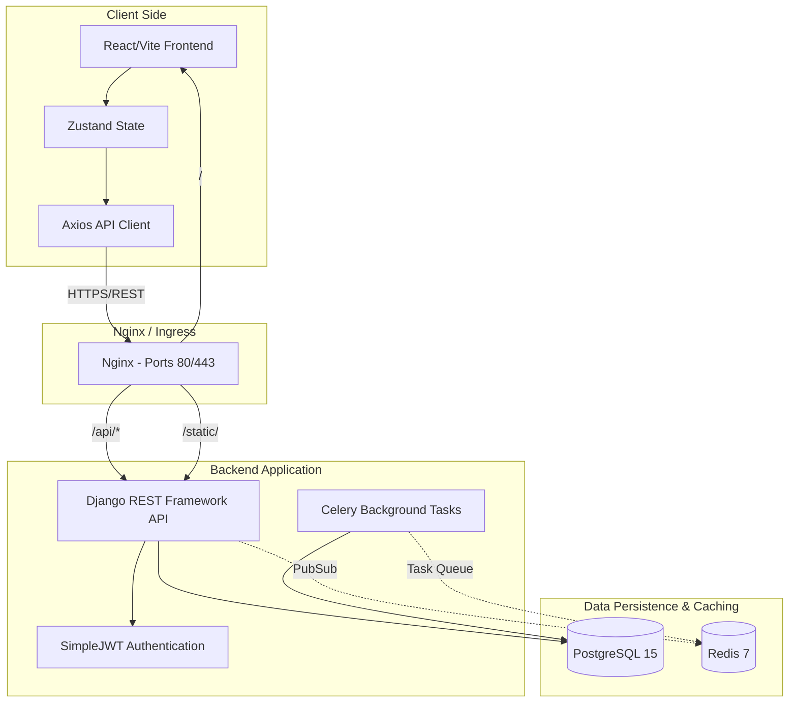

# System Architecture Overview

The Youth Internship E-Recruitment Portal is a modern, full-stack application built around a decoupled architecture. It separates the presentation layer (Frontend) from the business logic and data persistence layers (Backend), communicating securely via RESTful APIs.

## Architecture Diagram

## Core Components

### 1. Frontend Layer
*   **Framework:** React 19 bootstrapped with Vite.
*   **Purpose:** Delivers a fast, interactive Single Page Application (SPA) experience for applicants and administrators.
*   **Language:** JavaScript (ES6+), utilizing JSX.
*   **Styling:** Tailwind CSS v4 for a highly responsive, customized UI system.
*   **State Management:** Zustand is used to circumvent prop-drilling, managing global states such as authentication tokens, user profiles, and active interfaces.

### 2. API / Backend Layer
*   **Framework:** Django 5 with Django REST Framework (DRF).
*   **Purpose:** Houses all business logic, data validation, database interactions, and administrative endpoints.
*   **Authentication:** JWT (JSON Web Tokens) via `djangorestframework-simplejwt`. Tokens are issued upon login and sent via HTTP Bearer headers.
*   **Task Queues:** Celery (when applicable) to process long-running background tasks such as notification emails or batch PDF processing.

### 3. Data & Caching Layer
*   **Primary Database:** PostgreSQL 15. Known for high concurrency and robust relational integrity. Handles Users, Profiles, Jobs, Applications, and Documents mapping.
*   **Broker / Store:** Redis 7 acts as the broker for Celery and the ephemeral store for system-wide caching, alleviating pressure from the main database.

### 4. Infrastructure Layer
*   **Reverse Proxy:** Nginx routes traffic dynamically. Requests pointing to `/api/` or `/admin/` are proxied to Django, while root paths `/` serve the static React frontend or direct to the Vite dev server.
*   **Containerization:** Docker Compose manages the local and test environments, spinning up isolated containers for `backend`, `frontend`, `db`, `redis`, `celery`, and `nginx`.

## Data Flow Lifecycle (Application Example)

1.  **Action:** A user clicks "Apply" on a Job card.
2.  **Client State:** Zustand triggers an Axios POST request combining the `job_id` and the Bearer token in the header.
3.  **Proxy Routing:** Nginx catches the request and routes it to `backend:8000/api/jobs/apply/`.
4.  **Backend Validation:** DRF validates the token via SimpleJWT. It checks if the Applicant has uploaded all mandatory documents (ID, Certs, etc.).
5.  **Persistence:** The `Application` model is instantiated and saved to PostgreSQL.
6.  **Response:** The backend returns a 201 Created payload.
7.  **Client Update:** Zustand updates the global state, moving the vacancy to the "Applied" list, re-rendering the React view instantly.
