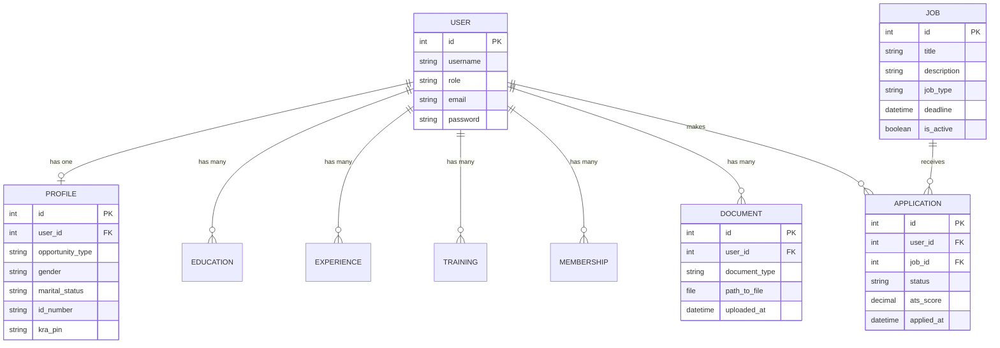

# Database Schema Overview

The database leverages PostgreSQL 15, optimized for relational integrity and strict constraints. The main entities are centered around `User`, representing both Administrators and Applicants.

## Entity Relationship Diagram (ERD)

## Data Dictionary

### `accounts_user`
Extended from Django's `AbstractUser`.
*   **role** (`VARCHAR`): Determines system access level. Choices: `ADMIN`, `APPLICANT`. Determines RBAC permissions.

### `accounts_profile`
Linked `OneToOne` with the generic User model to store applicant-specific biographical schema.
*   **opportunity_type**: `ATTACHMENT`, `INTERNSHIP`, `NONE`. Used to filter relevant opportunities.
*   **national_identifiers**: `id_number`, `kra_pin`, `nssf_number`, `nhif_number` (All `VARCHAR`).
*   **biodata**: `dob`, `gender`, `marital_status`, `county_of_residence`.

### Background Relational Models
These scale infinitely on a `ForeignKey` directly deleting `on_delete=CASCADE` upon User deletion.
*   **`accounts_education`**: `institution`, `qualification`, `field_of_study`, `start_date`, `end_date`, `is_current`.
*   **`accounts_experience`**: `organization`, `job_title`, `responsibilities`.
*   **`accounts_training`** / **`accounts_professionalmembership`**.

### `accounts_document`
The pivot for the Applicant Tracking System (ATS) validation layer.
*   **user** (`FK`): Owner of the document.
*   **document_type**: Critical enums driving validation (`TRANSCRIPT`, `NATIONAL_ID`, `RESUME`, `COVER_LETTER`, `INSTITUTION_INTRO`, `GOOD_CONDUCT`, `KRA_PIN`, `BIRTH_CERT`, `ACADEMIC_CERT`).
*   **file**: The local or cloud storage path.
*   **Constraint**: `unique_together` on `('user', 'document_type')`. A user cannot upload multiple files of the same type; they must overwrite the existing record.

### `jobs_job`
Stores the actual Vacancies the administration maps out.
*   **job_type**: Connects to Applicant's `opportunity_type`. `INTERNSHIP`, `ATTACHMENT`, `JOB_OPENING`.
*   **is_active** (`BOOLEAN`): Soft deletion/toggling of visibility without wiping relational applicant data.

### `jobs_application`
The associative pivot between generic Users and Jobs.
*   **user** (`FK`) & **job** (`FK`): Uniquely mapped (`unique_together`); a user can only apply once to a specific job.
*   **status**: Lifecycle mappings -> `PENDING` > `SHORTLISTED` > `REJECTED` / `HIRED`.
*   **ats_score**: Mathematical abstraction (Decimal Field) injected programmatically based on algorithmic document scans, profile completeness, and role compatibility.
